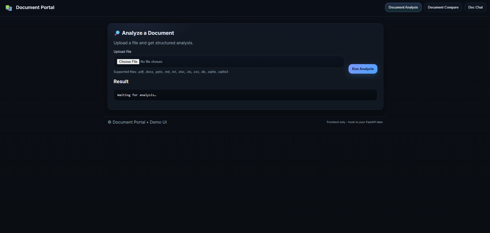
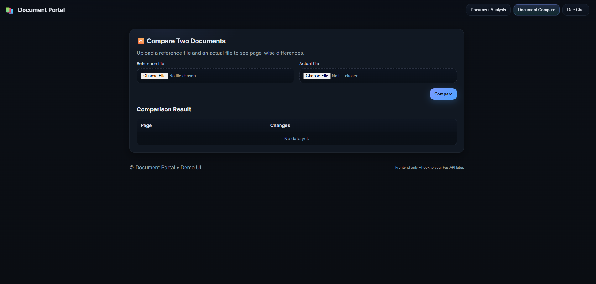
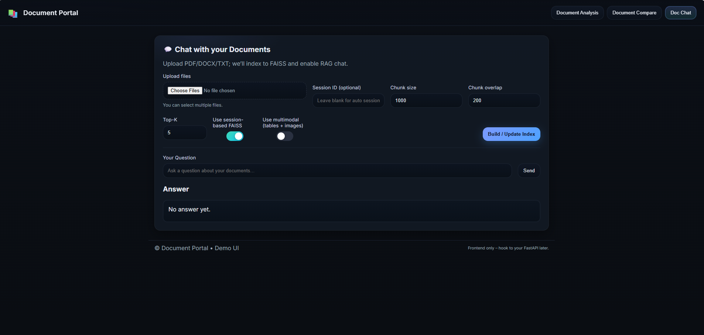
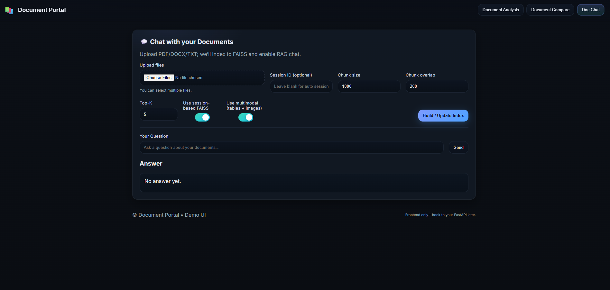

# RAG Document Intelligence Platform

## Project Overview
The Document Portal Analysis platform automates the process of reviewing, comparing, and querying business documents such as invoices and reports from multiple vendors. By leveraging Retrieval-Augmented Generation (RAG) and large language models, it provides insights, highlights differences, and enables interactive document exploration, reducing manual work and improving decision-making efficiency.

## Use Case
Businesses often receive numerous reports or invoices from global vendors, which are time-consuming to review manually. This portal provides a unified interface for analyzing documents, comparing them, and querying content interactively, streamlining operational workflows.

## Features

### Secure User Access
- Users can register and log in with credentials  
- All document services are restricted to authenticated users

### Document Analysis
- Upload a single Document to extract insights  
- Provides detailed information from the document content

### Document Comparison
- Upload two Documents to view differences side-by-side  
- Useful for tracking changes across vendor reports or invoices

### Single Document Chat
- Query a single document using natural language  
- System returns relevant answers based on the document's content

### Multi-Document Chat
- Upload multiple Documents and query across all documents  
- Enables comprehensive analysis from multiple sources

## Technologies
- Python  
- LangChain  
- FastAPI  
- Streamlit  
- Google Embeddings  
- FAISS  
- Groq LLM Models  
- Google Gemini LLM  
- Docker  
- CI/CD with GitHub Actions  
- AWS (ECR, ECS, Fargate, Secret Manager)

## How It Works
1. Documents are converted into vector embeddings  
2. FAISS is used for efficient retrieval  
3. Relevant document sections are passed to LLMs via a RAG pipeline  
4. Users can interact, compare, and query documents based on context

## Installation

1. **Clone the repository**:

   git clone https://github.com/gajamsaikumar/document_portal_RAG.git

2. **Create the virtual environment**:

    conda create -p env python=3.10 -y

3. **Activate the virtual environment**:

    conda activate env

4. **Install the required dependencies**:

    pip install -r requirements.txt

**Generate API Keys**

1. **Create a .env file** in your current folder.

2. **Groq API Key:**

    * Go to the Groq Console(https://console.groq.com/keys)

    * Go to the API Keys tab.

    * Click on "Create API Key" and copy the key.

    * Paste the key in the .env file:
        GROQ_API_KEY="YOUR_API_KEY_HERE"
3. **Google API Key:**
    * Go to Google AI Studio(https://aistudio.google.com/prompts/new_chat)
    * Create an API key.
    * Paste the key in the .env file:
        GOOGLE_API_KEY="YOUR_API_KEY_HERE"

